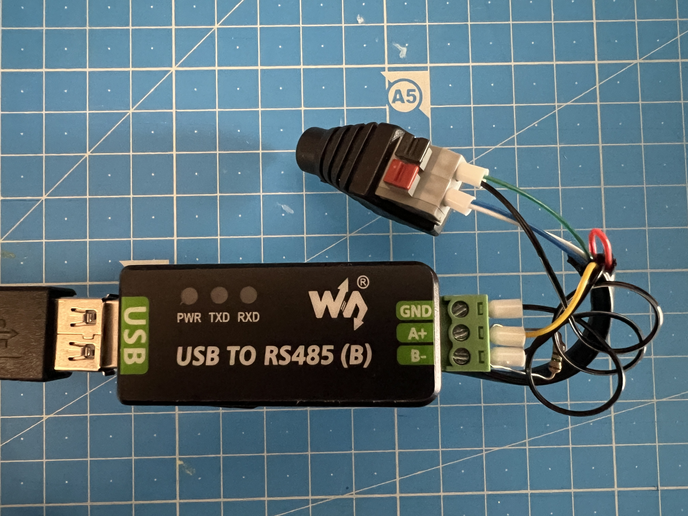
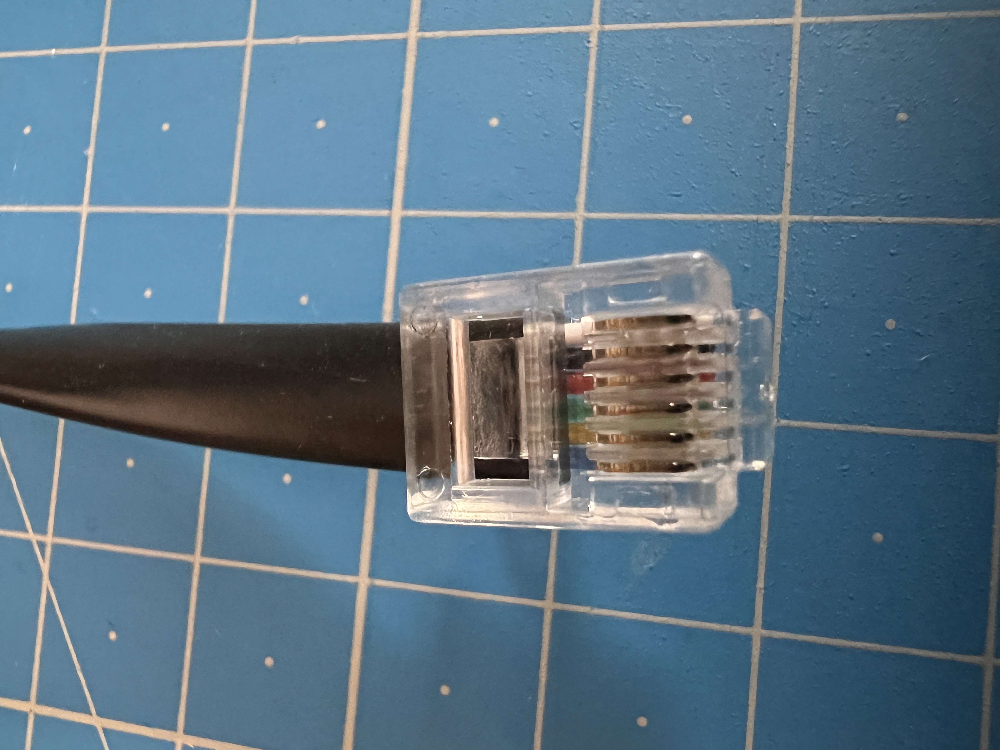

# Hardware Notes

Raw observations of the OEM SpiderFarmer GSS hub, kept separate from
the protocol reference.

## Required hardware

- USB to RS-485 converter — I used the [Waveshare USB-to-RS485-B](https://www.waveshare.com/usb-to-rs485-b.htm).
- 12V DC power adapter - I used 1A and it seemed enough, a more powerful one likely won't hurt

## Wiring

The cable is a 6-conductor RJ12 lead carrying both the RS-485 differential pair
and the +12 V supply for the peripheral. The diagram below shows where each
wire lands on the controller side.

### RJ12 pinout (peripheral-side)

| Pin colour | Signal         |
| ---------- | -------------- |
| green      | GND            |
| blue       | +12 V          |
| white      | +12 V          |
| black      | RS-485 (B)     |
| yellow     | RS-485 (A)     |
| red        | (unused / TBD) |

## GSS OEM hub board

- MCU: **ESP32-S3-WROOM-1**
- Ethernet PHY: likely [Davicom DM9051](https://www.davicom.com.tw/production-item.php?lang_id=en)
  (SPI MAC+PHY; S3 has no internal EMAC, and the pin-compatible DM9051
  is what fits the 25 MHz crystal next to U6)
- RS-485 transceiver: TBD (on-board, DE-driven)
- LCD: parallel TFT (driver chip not yet identified — candidates
  include ILI9341, ST7789V, ST7796, ILI9488)

See [`firmware/sf-gss.yaml`](../firmware/sf-gss.yaml) for a draft
ESPHome firmware that can flash this hardware as a drop-in replacement
for the OEM firmware — bring-up still needs the LCD pin mapping and
driver chip verified.

## Other interesting resources

- [PCB preview video](https://www.youtube.com/watch?v=0Yn37gflFO0) — author was kind enough to record it so you don't have to open your GSS controller.
